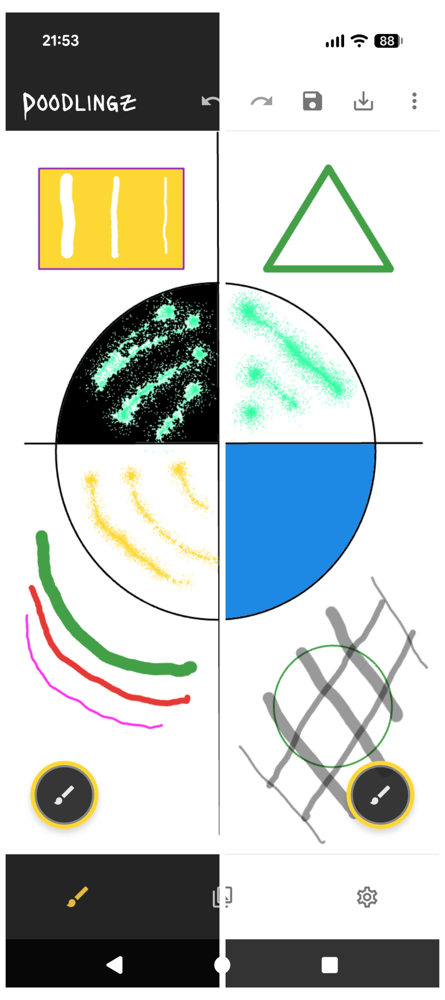
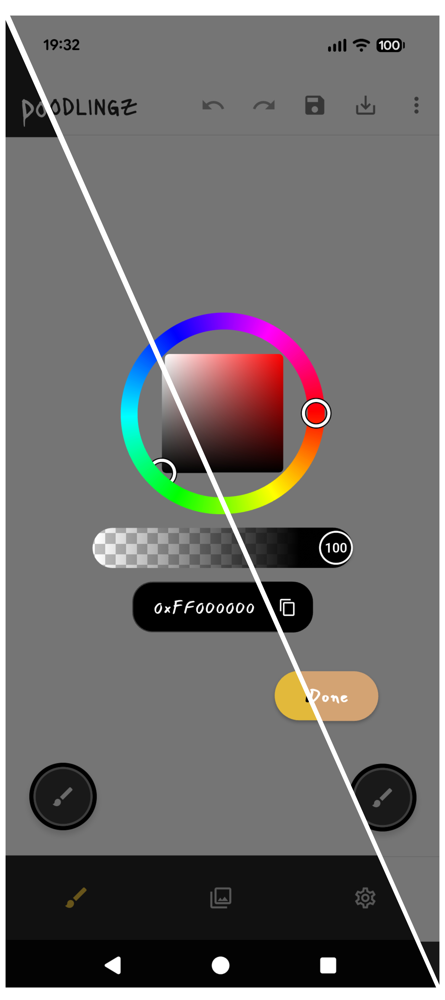
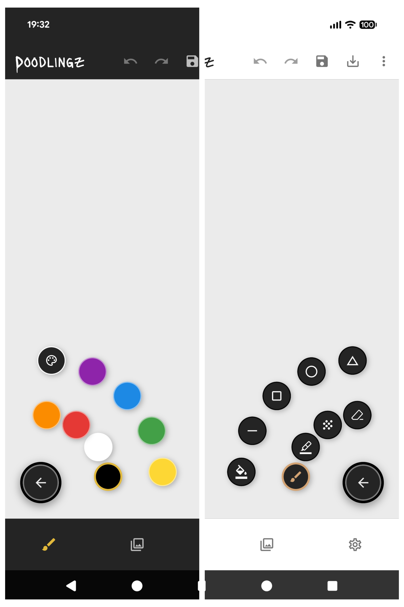
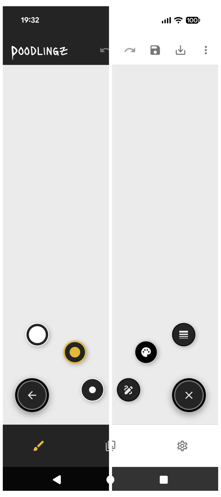
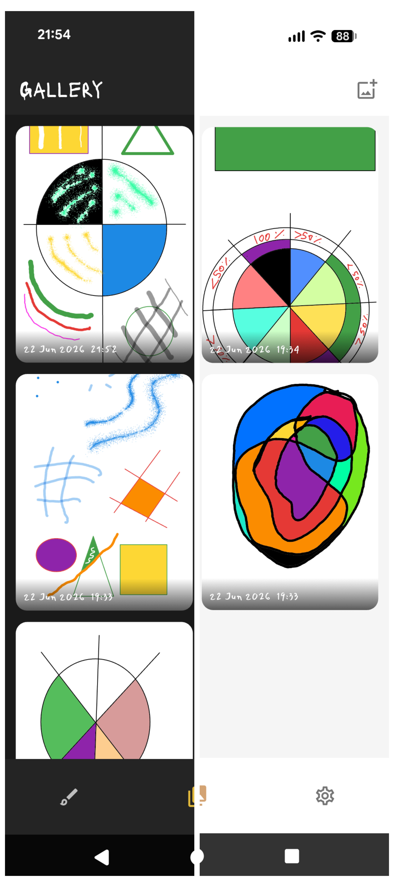
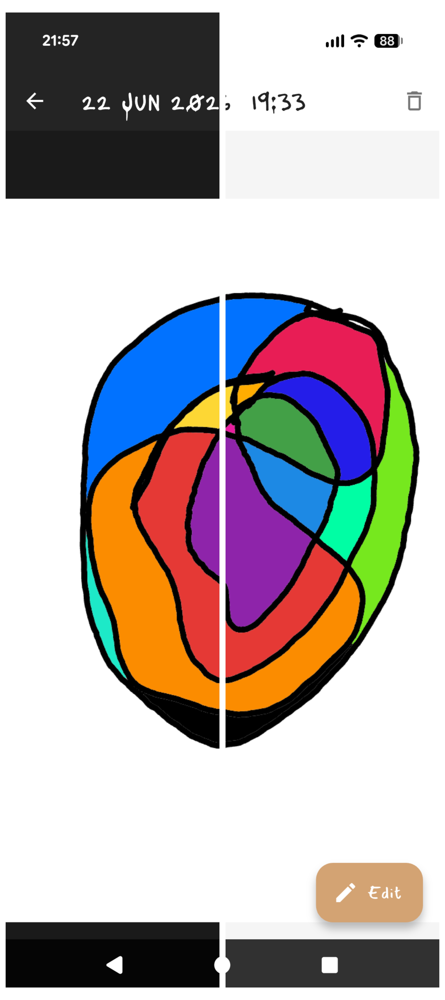
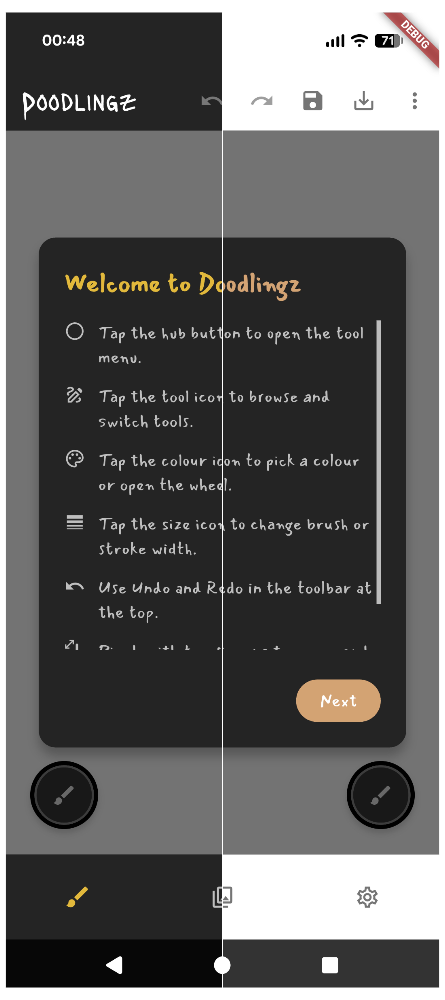
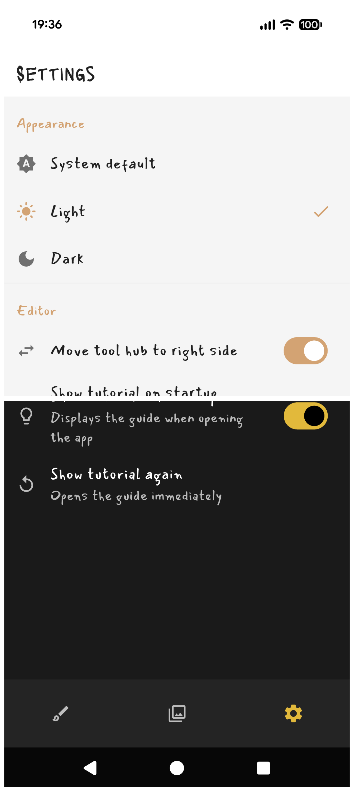
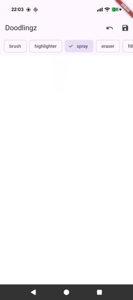
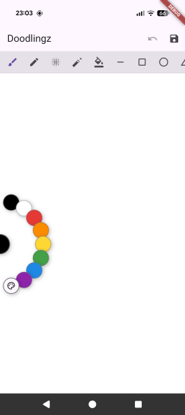

# Doodlingz

A mobile drawing app that lets you sketch, paint, and save your ideas anywhere — no internet, no stylus required.

---

## Screenshots

| Drawing | Color Wheel | Colors & Tools | Hub & Sizes |
| --- | --- | --- | --- |
|  |  |  |  |

| Gallery | Viewer | Onboarding | Settings |
| --- | --- | --- | --- |
|  |  |  |  |

---

## Table of Contents

- [Project Overview](#project-overview)
- [Feature Summary](#feature-summary)
- [Bonus Features](#bonus-features)
- [Dependencies](#dependencies)
- [Setup and Installation](#setup-and-installation)
- [Reviewer Guide](#reviewer-guide)
- [Usage Guide](#usage-guide)
- [Design Decisions and Challenges](#design-decisions-and-challenges)

---

## Project Overview

Doodlingz is a Flutter drawing application for Android. It gives you a full-screen white canvas with a minimal dark-chrome UI that stays out of the way while you draw. Tools are accessed through a nested radial hub in the corner of the screen, keeping the entire canvas surface available for drawing. Drawings are saved as PNG files to local device storage, browsed in a gallery, and can be re-opened for editing. The app works fully offline and requires no account or external services.

For the architecture, raster pipeline, flood-fill algorithm, and tool internals in depth, see [TECHNICAL_OVERVIEW.md](TECHNICAL_OVERVIEW.md).

---

## Feature Summary

### Core Features

| Feature | Description |
| --- | --- |
| Brush | Freehand drawing in 3 sizes |
| Eraser | Restores pixels to the white canvas color in 3 sizes |
| Spray / Airbrush | Scattered-dot airbrush in 2 sizes |
| Fill | Flood-fill any enclosed region or the whole canvas |
| Straight line | Drag to draw a line, preview shown while dragging |
| Rectangle | Drag to size; draw squares by dragging to equal sides |
| Ellipse | Drag to size; draw circles by dragging to equal sides |
| Color picker | 8 preset swatches plus a full wheel picker with hex input and opacity |
| Undo | 20-step undo history |
| Save | Saves the drawing as a PNG to local storage with a timestamp filename |

### Extra Features

| Feature | Notes |
| --- | --- |
| Triangle shape tool | Extra shape — same drag-to-size gesture as rectangle and ellipse |
| Highlighter tool | Extra tool — semi-transparent stroke that multiplies onto what's beneath |
| Gallery | Grid of saved drawings from local storage, ordered newest-first by creation time |
| Edit a saved drawing | Open any saved drawing, edit it, then save as a new file or overwrite the original |
| Reviewer-ready APK | Pre-built APK on Google Drive; three install methods documented below |

---

## Bonus Features

| Feature | What it does |
| --- | --- |
| **Pinch-to-zoom and pan** | Two-finger pinch zooms the canvas up to 5×; drag with two fingers to pan. Drawing with one finger works normally at any zoom level. The view resets to 1:1 when opening a new or saved drawing. |
| **Redo** | Full redo stack — restores steps undone in the current session |
| **Left-handed mode** | Mirrors the tool hub to the bottom-right corner via a Settings toggle |
| **Export to device gallery** | Saves the drawing into a `Doodlingz` album in the device photo gallery (via `gal`) |
| **Import an image** | Pick a photo from the device gallery and open it on the canvas. The canvas reshapes to the image's aspect ratio (no crop, no distortion) so any photo — wide, tall, or square — imports cleanly |
| **Multi-select delete** | Long-press a gallery tile to enter selection mode and delete several drawings at once |
| **Onboarding overlay** | Two-page guide shown on first launch, replayable any time from Settings |
| **New / clear canvas** | Start a fresh drawing or wipe the current canvas to white, with confirmation prompts |
| **Splash screen** | Brief branded launch screen — app icon, wordmark, and a loading indicator — shown before the editor opens |

---

## Dependencies

| Package | Purpose |
| --- | --- |
| `flutter_bloc` | Cubit state management across all screens |
| `equatable` | Value equality for Cubit states — prevents unnecessary rebuilds |
| `get_it` | Dependency injection via service locator |
| `shared_preferences` | Persists theme mode, hub handedness, and the onboarding setting |
| `path_provider` | Resolves the app documents directory for PNG storage |
| `intl` | `DateFormat` for timestamp-based filenames |
| `google_fonts` | Mansalva for body text, Lacquer for the app-bar wordmark — bundled locally in `google_fonts/` with runtime fetching disabled so the fonts are guaranteed available offline from a fresh install |
| `flex_color_picker` | Color wheel dialog with hex input and opacity slider |
| `gal` | Exports a drawing into the device photo gallery |
| `image_picker` | Imports a photo from the device gallery onto the canvas |
| `material_symbols_icons` | Supplies the eraser and highlighter glyphs (`Symbols.ink_eraser`, `Symbols.format_ink_highlighter`), absent from the standard Material icon set |
| `flutter_launcher_icons` *(dev)* | Generates the Android adaptive launcher icon from a single source asset |

---

## Setup and Installation

Most reviewers should use the pre-built APK in the Reviewer Guide below. These steps are for building from source.

### Prerequisites

- Flutter (stable channel) bundling Dart 3.12 or later — the project's SDK constraint is `^3.12.0`
- Android SDK with a connected device or emulator

### Steps

```bash
git clone
cd pixel-painter
flutter pub get
flutter run
```

No code generation step is required — the project has no `build_runner` dependency.

### Building a release APK

```bash
flutter build apk --release
```

The output APK is at `build/app/outputs/apk/release/doodlingz-release.apk`.

---

## Reviewer Guide

A pre-built APK is provided so the app can be tested without installing Flutter.

**APK download:** [Google Drive — doodlingz.apk](https://drive.google.com/file/d/1fO8PFBLvdAaYrhiPoSLz_9Szo2HariqD/view?usp=drive_link)

---

### Option 1: Install directly on an Android device

#### Step 1 — Allow installation from outside the Play Store

1. Open **Settings** on your device.
2. Search for **"Install unknown apps"** or go to **Security → Install unknown apps**.
3. Find **Chrome** and toggle **Allow from this source** on.

#### Step 2 — Download and install

1. On your Android phone, open **Chrome** and tap the Google Drive link above. Tap **Download**.
2. Open the **Files** app → **Downloads**.
3. Tap **doodlingz.apk** → **Install**. If Play Protect warns you, tap **Install anyway**.
4. Find **Doodlingz** in your app drawer and launch it.

---

### Option 2: Lightweight emulator (BlueStacks or NoxPlayer)

#### BlueStacks

1. Download from [bluestacks.com](https://www.bluestacks.com) and install.
2. Drag and drop the APK onto the BlueStacks window — it installs automatically.
3. Launch **Doodlingz** from the My Apps tab.

#### NoxPlayer

1. Download from [bignox.com](https://www.bignox.com) and install.
2. Drag and drop the APK onto the NoxPlayer window, or use the APK installer in the toolbar.
3. Launch **Doodlingz** from the home screen.

---

### Option 3: Browser-based emulator (Appetize.io)

1. Go to [appetize.io](https://appetize.io).
2. Click **Upload** and select the APK.
3. Click **Run** to start the virtual device in your browser.
4. Click = tap, click-and-drag = swipe.

Sessions time out after a few minutes of inactivity on the free tier. Refresh and click Run again to restart.

---

## Usage Guide

### First launch

On the first launch a two-page onboarding overlay appears: page one explains the hub and tab navigation, page two is a tool reference. Dismiss it to start drawing. You can replay it any time from Settings.

### Drawing on the canvas

The white canvas fills the screen. Draw by dragging your finger. The tool hub handle sits in a bottom corner — tap it to open tool, color, and size controls.

### Tool hub

Tap the circular handle in the bottom corner to open the hub. The root level shows up to three category nodes: **Tools**, **Color**, and **Size**. Tap a category to expand it into its options, then tap an option to select it and close the hub. While in a sub-level the handle shows a back arrow to return to the root. The size node is hidden when the fill tool is active (fill has no stroke width). The color node is hidden when the eraser is active (the eraser always paints the canvas background color, so the picker has no effect). Tap the handle again or the scrim to close without changing anything.

### Zooming and panning

Pinch with two fingers to zoom in up to 5×. Drag with two fingers to pan the canvas while zoomed. All drawing tools work normally at any zoom level — use zoom to place precise strokes or fine details. The view resets to 1:1 when you open a new drawing, load from the gallery, or import an image.

### Shapes

Select line, rectangle, ellipse, or triangle from the Tools level. Tap and drag on the canvas — a live preview follows your finger, and the shape is committed when you lift it. A square or circle comes out of dragging the rectangle or ellipse to equal sides.

### Undo and redo

Undo and redo buttons are in the app bar. Up to 20 undo steps are stored per session. The redo stack is cleared when you make a new drawing action after undoing.

### Saving

Tap the save icon in the app bar. For a new drawing the file is saved straight away with a timestamp filename. For a drawing opened from the gallery, a sheet offers **Save as new drawing** or **Overwrite existing**. A snackbar confirms the save.

### New drawing and clear canvas

The **New drawing** action starts a fresh canvas and clears the undo history; if the current drawing has unsaved changes it warns first. **Clear canvas** wipes the canvas to white as a single undoable step, so you can undo it if needed.

### Gallery

The Gallery tab shows all saved drawings in a grid, newest first. Tap a drawing to open it in a read-only viewer, then tap **Edit** to load it into the editor — from there, saving offers overwrite or save-as-new.

### Multi-select delete

Long-press a gallery tile to enter selection mode, tap any number of drawings to select them, then confirm the delete. This cannot be undone.

### Importing an image

From the Gallery tab, import a photo from the device gallery. It opens on the canvas as a new drawing. The canvas takes the photo's aspect ratio — a wide photo gives a wide canvas, a tall one a tall canvas — so the whole image is shown without cropping or stretching. Very large photos are scaled down to keep the canvas within its pixel budget. Saving an imported image creates a new file rather than altering the original photo.

### Export to device gallery

Use **Export** in the editor to save the current drawing into a `Doodlingz` album in your device's photo gallery. If there are unsaved changes you can save-and-export or export anyway. Exporting requires gallery permission.

### Settings

Open the Settings tab to choose system, light, or dark theme, toggle **Move tool hub to right side**, toggle whether the onboarding overlay shows on startup, and replay the onboarding overlay on demand.

---

## Design Decisions and Challenges

### Budget-bounded raster buffer

Drawing happens against a pixel buffer whose *area* is capped (810×1080 = 874,800 pixels) but whose *shape* adapts: a blank new drawing fills the editor area so it doesn't letterbox, and an imported image keeps its own aspect ratio. The display layer scales that buffer to fit with a single uniform scale, never separate per-axis scales that would distort it. Bounding the pixel *area* rather than fixing the dimensions is what keeps brush sizes, fill cost, and undo-snapshot memory consistent across devices and any imported shape — those all scale with pixel count, not with the buffer's proportions. The drawable area is exactly the canvas; any letterbox margin around it is non-drawable app background, marked off with a lighter fill and a thin border.

### Importing an image at any aspect ratio

Imported photos rarely match the canvas's proportions. Three options exist for fitting a mismatched image: crop it to fill (loses content), letterbox it (leaves dead bars), or reshape the canvas to the image. Doodlingz reshapes the canvas — the imported image keeps its exact aspect ratio with no crop and no bars, scaled down only if needed to stay within the pixel budget. The consequence is that the drawable area becomes the image itself; you draw on the photo rather than in a margin around it, which is the right model for an edit-the-photo workflow. The same single uniform-scale fit is shared between what's drawn on screen and where touches map to, so a stroke always lands exactly under the finger regardless of the imported shape.

### Hybrid vector-preview / raster-commit pipeline

During a gesture, strokes are drawn as vectors via `CustomPainter` for smooth, zero-lag preview; on pointer-up the stroke is committed to a `ui.Image` raster buffer. This keeps drawing responsive without accumulating an ever-growing vector list that would slow repaints over a long session.

### Flood fill on a background isolate, with edge blending

Flood fill is iterative (queue-based, not recursive) and runs via `compute()` on a background isolate, so full-canvas fills never overflow the stack or freeze the UI. Anti-aliased stroke edges are handled by blending each rejected edge pixel toward the fill color in proportion to how close it already was to the target color — this fills the halo without bleeding through thin outlines.

### Single app-scoped editor

There is one editor instance for the whole app. The gallery and image import trigger a load into that editor tab rather than opening a second editor screen, which avoids two live canvas controllers and two competing undo stacks. The save flow tracks whether the canvas came from an existing file (offering overwrite) or is new/imported (save-as-new only).

### Radial hub instead of a fixed tool panel

A fixed toolbar would permanently shrink the drawable area. The radial hub only occupies space when open, keeping the full canvas available while drawing, and is anchored to a corner so its arc is reachable with one thumb.

| v1 — flat text toolbar | v2 — icon toolbar with colour picker |
| --- | --- |
|  |  |

Both versions kept the toolbar pinned above the canvas, permanently consuming screen space. The radial hub replaced both.

### Eraser as a white brush

The eraser restores pixels to the canvas's fixed white color rather than using a transparency erase. This matches the requirement to restore the affected area to the default color and keeps the raster buffer — and exported PNGs — opaque.

### Hand-drawn typography, applied per-slot rather than theme-wide

The app uses Mansalva for body text and Lacquer for the app-bar wordmark — both hand-drawn Google Fonts that suit a drawing app better than a standard UI typeface. The body size increase (`+2`) is applied with an explicit `copyWith` on each `TextTheme` slot rather than `TextTheme.apply(fontSizeDelta: ...)`. The latter throws a runtime assertion if any individual slot's `fontSize` is null — a state `flutter analyze` cannot see, since it only surfaces when that specific style is actually built and rendered. The per-slot rebuild guarantees a concrete `fontSize` on every slot, so the assertion can never trigger regardless of which slots Flutter or `google_fonts` leave unset.

### Editor overflow actions as a bottom sheet, not a popup menu

New drawing and Clear canvas were originally a `PopupMenuButton` in the app bar. It was replaced with a `showModalBottomSheet`, matching the save/export/clear confirmation pattern used everywhere else in the editor. Beyond consistency, the bottom sheet's own surface color visibly separates it from the screen behind it in dark mode; the popup menu relied on a modal scrim that barely dimmed an already-dark app bar, making the menu look like it was layered directly on the bar instead of a distinct surface.
